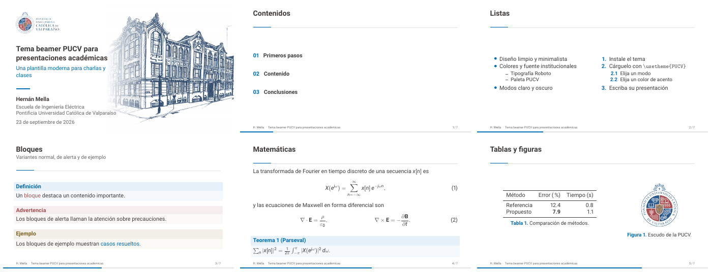
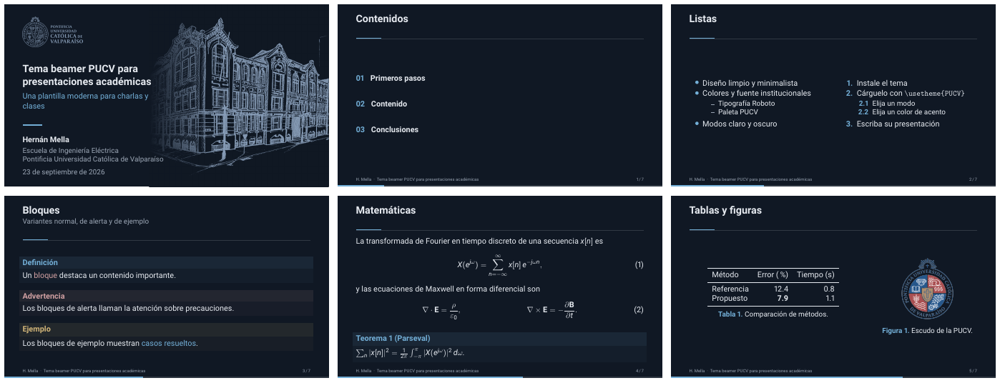

# Tema beamer PUCV

Tema moderno de [beamer](https://ctan.org/pkg/beamer) para presentaciones
académicas de la Pontificia Universidad Católica de Valparaíso (PUCV). Los
colores y la fuente (Roboto) siguen las
[normas gráficas de la PUCV](https://www.pucv.cl/uuaa/normas-graficas-pucv).

| Claro | Oscuro |
|:---:|:---:|
|  |  |

## Instalación

Instale el tema en su árbol TeX personal (`TEXMFHOME`):

```bash
make install        # o bien ./install.sh
```

Para desinstalarlo use `make uninstall`. Alternativamente, copie el contenido
de `src/` junto a su archivo `.tex`.

## Uso

```latex
\documentclass[aspectratio=169]{beamer}
\usepackage[spanish,es-noshorthands]{babel}
\usetheme{PUCV}                       % modo claro
% \usetheme[mode=dark]{PUCV}          % modo oscuro

\title{Título}
\subtitle{Subtítulo}
\author[Nombre corto]{Nombre completo}
\institute{Escuela de Ingeniería Eléctrica\\
  Pontificia Universidad Católica de Valparaíso}

\begin{document}
\maketitle                             % portada a sangre y sin numerar
\section{Introducción}                 % agrega una diapositiva separadora
\begin{frame}{Título de la diapositiva}{Subtítulo opcional}
  Contenido
\end{frame}
\end{document}
```

Con `babel` en español se recomienda la opción `es-noshorthands`, ya que los
atajos del español interfieren con las especificaciones de overlays de beamer
(`<2->`, etc.). El tema traduce al español los nombres de los entornos de
beamer (Teorema, Definición, Ejemplo, Demostración, etc.).

La portada usa el logo oficial horizontal de la PUCV: a color en modo claro y
en su versión calada en modo oscuro, teñida con el mismo tono de las líneas
del dibujo de la Casa Central.

### Títulos largos y muchos autores

- La portada se adapta a su contenido: primero reduce el tamaño del título,
  luego ensancha la columna de texto (desplazando la imagen de portada a la
  derecha) y, como último recurso, reduce el bloque de texto completo.
- Los autores separados con `\and` se listan con comas; se admiten las marcas
  `\inst{}` y varias instituciones.
- El pie de página muestra `autor corto · título corto`, truncados con puntos
  suspensivos si no caben. Para listas de autores o títulos largos, indique
  versiones cortas: `\author[Mella et al.]{...}` y `\title[Título corto]{...}`.

Vea [`examples/presentacion.tex`](examples/presentacion.tex) para un ejemplo
completo (listas, bloques, matemáticas, tablas, figuras, overlays y apéndice).

## Opciones

Las opciones se indican como `\usetheme[<clave>=<valor>, ...]{PUCV}`.

| Opción        | Valores                              | Por defecto | Descripción                                                  |
|---------------|--------------------------------------|-------------|--------------------------------------------------------------|
| `mode`        | `light`, `dark`                      | `light`     | Modo de color (claro u oscuro).                              |
| `accent`      | `blue`, `red`, `gold`                | `blue`      | Color principal; los otros dos se usan en alertas y ejemplos. |
| `progressbar` | `foot`, `head`, `none`               | `foot`      | Posición de la barra de progreso.                            |
| `sectionpage` | `true`, `false`                      | `true`      | Inserta una diapositiva separadora en cada `\section`.       |
| `numbering`   | `fraction`, `counter`, `none`        | `fraction`  | Formato del número de diapositiva en el pie.                 |
| `titleimage`  | `default`, `none`, *nombre de archivo* | `default` | Imagen a la derecha de la portada.                           |

El tema define los colores institucionales `pucv-blue`, `pucv-navy`,
`pucv-red`, `pucv-gold` y `pucv-gray`, y los colores que dependen del modo
`pucv-bg`, `pucv-fg`, `pucv-muted`, `pucv-accent`, `pucv-alert` y
`pucv-example`. Prefiera estos últimos en sus diapositivas para que funcionen
tanto en modo claro como oscuro.

## Estructura

| Archivo                        | Contenido                                                  |
|--------------------------------|------------------------------------------------------------|
| `src/beamerthemePUCV.sty`      | Punto de entrada: opciones, portada, separadores, traducciones. |
| `src/beamercolorthemePUCV.sty` | Paleta institucional y colores semánticos claro/oscuro.    |
| `src/beamerfontthemePUCV.sty`  | Roboto y jerarquía tipográfica.                            |
| `src/beamerinnerthemePUCV.sty` | Portada, separadores de sección, listas, bloques e índice. |
| `src/beamerouterthemePUCV.sty` | Título de diapositiva, pie de página y barra de progreso.  |
| `assets/`                      | Dibujo de la portada y logos oficiales originales (`make covers`, `make logos`). |
| `examples/`                    | Presentación de ejemplo.                                   |
| `tests/`                       | Pruebas de estrés (títulos largos, muchos autores).        |

## Desarrollo

```bash
make            # compila examples/build/presentacion-{claro,oscuro}.pdf
make examples   # compila también las variantes 4:3
make test       # pruebas de estrés en modo claro/oscuro, 16:9 y 4:3
make covers     # regenera las imágenes de portada (requiere ImageMagick)
make logos      # regenera los logos de la portada desde assets/ (requiere ImageMagick)
make clean
```

El archivo `latexmkrc` del repositorio agrega `src/` a `TEXINPUTS`, por lo que
los ejemplos compilan sin instalar el tema. El tema funciona con pdfLaTeX,
LuaLaTeX y XeLaTeX.

## Contacto

Hernán Mella (PUCV) — hernan.mella@pucv.cl
